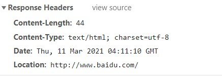

# http 模块的使用

> 复习 node.js 的使用，同时回顾计算机网络 http 相关内容

### 通信协议

1. **通用头信息**

   `Request URL`: 请求的 `URL`,对应浏览器地址栏；向服务器获取哪些内容
   `Request Method`: 请求的方法，获取内容的方法 `get/ post`
   `Remote Address`：请求的服务器的 IP 地址及端口号
   `Status Code`: 响应的状态码

   - 1\*\*：正在响应，还没有结束
   - 2\*\*：成功的响应
   - 3\*\*：响应的重定向，跳转到另一个 URL
   - 4\*\*：客户端请求错误
   - 5\*\*：服务器端错误;

   
   <br/>

2. **响应头信息**

   `Connection`: 连接方式，`keep-alive` 持久连接
   `Content-Encoding`: 内容压缩形式， `gzip`
   `Content-Type`: 响应的文件类型
   `Location`: 跳转的 URL,常配合着状态码 3\*\*使用

   
   <br/>

3. **请求头信息**
   `Connection`: 连接方式，`keep-alive` 持久连接
   `Accept`: 浏览器接收的文件类型有哪些
   `Accept-Encoding`: 接收的压缩形式有哪些
   `User-Agent`: 客户端使用的浏览器版本

   
   <br/>

### http 模块

1.  **模拟浏览器向 web 服务器发请求**

```node
http.get("http://www.weather.com.cn/weather1d/101040100.shtml", (res) => {
  console.log(res.statusCode, res.method);
  //数据监听
  res.on("data", (chunk) => {
    console.log(chunk.toString());
  });
  //监听结束
  res.on("end", () => {
    console.log("文件接收完毕");
  });

   res  响应的对象
      res.statusCode  //获取响应的状态码
      res.on('data', function(chunk){   })
     // 事件: 监听服务器端是否有数据传输过来,chunk就是传输的数据，格式为buffer

});
```

2. **创建服务器**

```node
const app = http.createServer(); //创建web服务器

app.listen(8080); //监听窗口

//接受请求，根据请求做出响应
app.on("request", (req, res) => {
  console.log(req.url, req.headers); //req.url得到的是端口号后面的部分
  //设置响应内容
  res.write("hello");
  // 设置响应头信息和状态码;
  res.writeHead(302, {
    location: "http://www.baidu.com",
    "content-type": "text/html",
  });
  //结束并发送内容到浏览器
  res.end();
});

 req  请求的对象
    req.url  请求的url，获取端口号后边的部分
    req.method  请求的方法
    req.headers  请求的头信息
  res  响应的对象
    res.write()  设置响应的内容
    res.writeHead( 状态码, 头信息对象 )
    res.end()  结束并发送响应到浏览器

```

3. **使用压缩提高服务器性能**

```node
const http = require("http");
const fs = require("fs");
const zlib = require("zlib"); //引入压缩模块

const app = http.createServer();

app.listen(8080);

app.on("request", (req, res) => {
  //设置响应头信息
  res.writeHead(200, {
    "content-type": "text/html",
    "content-encoding": "gzip", //设置压缩类型（解压缩）
  });
  //创建gzip压缩
  const gzip = zlib.createGzip();
  //创建可读流文件"baidu.html"
  //通过管道把可读流放入到压缩中
  //把压缩后的内容响应到浏览器
  fs.createReadStream("baidu.html").pipe(gzip).pipe(res);
});
```
